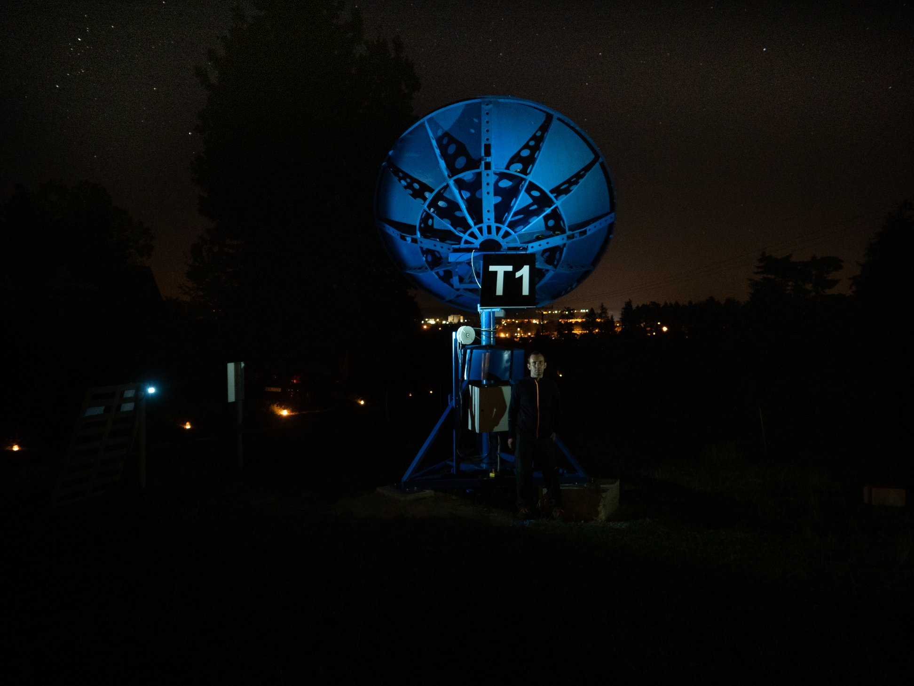

# TALIR01 - Automatic radio telescope

TALIR01 is a construction of an amateur radio telescope and satellite ground station being built at Svákov observatory, Soběslav, Czechia. It uses a parabolic dish antenna on motorized mount.

This repository holds documentation and software related to the construction.
